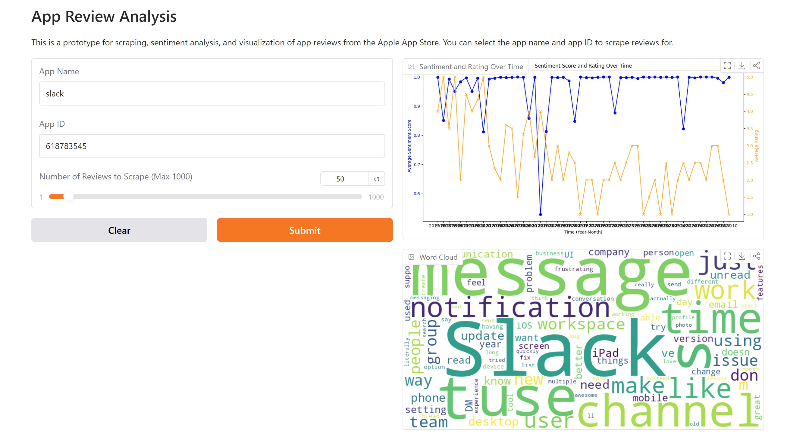

# App Review Analysis

This project performs a comprehensive analysis of app reviews from the Apple App Store. The project involves scraping reviews, performing sentiment analysis, categorizing reviews using GPT-4, and visualizing results. It provides valuable insights into user feedback through sentiment trends, feature requests, performance feedback, and more.

## Live Demo
https://huggingface.co/spaces/jacobwu/app-review-analysis

## Features

- **App Review Scraping**: Automatically fetches app reviews from the Apple App Store.
- **Sentiment Analysis**: Uses a pre-trained DistilBERT model to analyze the sentiment (positive/negative) of each review.
- **Categorization**: Leverages GPT-4 to categorize reviews into various feedback types (e.g., feature requests, UI issues).--> not included in the live demo
- **Visualization**: Plots graphs of sentiment scores and ratings over time, as well as generating word clouds from the most frequent words.
